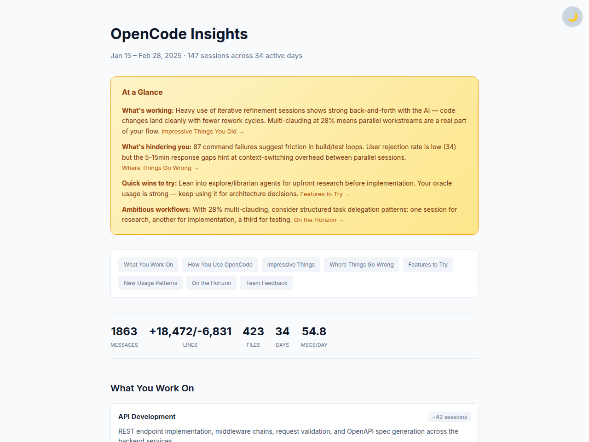
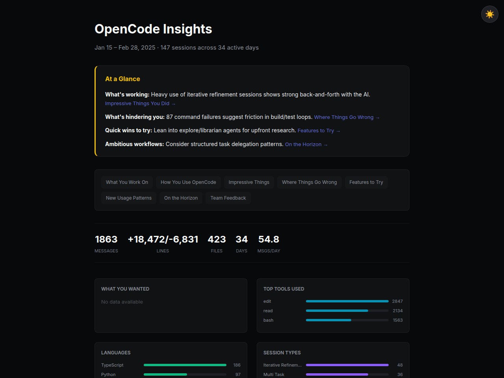
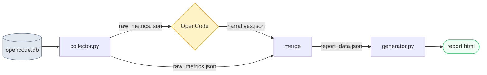

# OpenCodeInsights

A custom `/insights` command for [OpenCode](https://github.com/nicholascostadev/opencode) that generates
an interactive HTML analytics report from your session history — same format as Claude Code's `/insights`.

<p align="center">
  
</p>

<details>
<summary>Dark mode preview</summary>
<br>
<p align="center">
  
</p>
</details>

## What It Shows

- Per-session work summaries and project area classification
- Tool usage, agent distribution, language breakdown
- Response time distribution and activity by time of day
- Wins / friction points / actionable suggestions
- AGENTS.md recommendations and new workflow patterns

## Requirements

- **Python 3.10+** (zero external packages — stdlib only)
- **OpenCode** installed with session history (`~/.local/share/opencode/opencode.db`)

## Install

```bash
curl -sL https://raw.githubusercontent.com/rapidrabbit76/OpenCodeInsights/main/install.sh | bash
```

This single command will:
- Install the code to `~/.local/share/opencode-insights/`
- Register the `/insights` command in OpenCode
- Add `OPENCODE_INSIGHTS_HOME` to your shell rc

### Manual Install

```bash
git clone https://github.com/rapidrabbit76/OpenCodeInsights.git ~/.local/share/opencode-insights
cp ~/.local/share/opencode-insights/insights.md ~/.config/opencode/command/insights.md
echo 'export OPENCODE_INSIGHTS_HOME="$HOME/.local/share/opencode-insights"' >> ~/.zshrc
```

## Usage

### Via OpenCode Command (Recommended)

In an OpenCode session:

```
/insights
```

With options:

```
/insights --days 30
/insights --project <PROJECT_ID>
```

### Manual Execution

Run directly without the OpenCode command:

```bash
# 1. Collect metrics
python3 src/collector.py --days 14 -o output/raw_metrics.json

# 2. LLM generates narratives (this step is performed by the AI)
#    Analyze raw_metrics.json and write output/narratives.json

# 3. Merge and generate report
python3 -c "
import json
metrics = json.load(open('output/raw_metrics.json'))
narratives = json.load(open('output/narratives.json'))
with open('output/report_data.json', 'w') as f:
    json.dump({'metrics': metrics, 'narratives': narratives}, f, indent=2, ensure_ascii=False)
"
python3 src/generator.py -i output/report_data.json -o output/report.html

# 4. Open in browser
open output/report.html  # macOS
xdg-open output/report.html  # Linux
```

## How It Works



| File | Role |
|------|------|
| `src/collector.py` | Extracts session, message, and tool metrics from OpenCode's SQLite DB → JSON |
| `src/generator.py` | Merges metrics + AI narratives → interactive HTML report |
| `insights.md` | OpenCode `/insights` command definition (AI agent instructions) |

**Key point**: `collector.py` and `generator.py` handle pure data processing.
Narratives (analysis, summaries, recommendations) are written by the LLM based on the collected metrics.

## Configuration

### Environment Variables

| Variable | Description | Default |
|----------|-------------|---------|
| `OPENCODE_INSIGHTS_HOME` | Installation path of this project | Auto-detected under `$HOME` (4 levels deep) |

Example:

```bash
# Add to .bashrc or .zshrc
export OPENCODE_INSIGHTS_HOME="$HOME/.local/share/opencode-insights"
```

If unset, the `/insights` command auto-discovers the installation via `find` under `$HOME`.

### Collector Options

```
python3 src/collector.py [options]

--db PATH       Path to OpenCode DB (default: ~/.local/share/opencode/opencode.db)
--days N        Only include sessions from the last N days
--project ID    Filter by project ID
--output, -o    Output file path (default: stdout)
```

### Generator Options

```
python3 src/generator.py [options]

--input, -i     Input JSON file (merged metrics + narratives) [required]
--output, -o    Output HTML file path [required]
```

## Project Structure

```
OpenCodeInsights/
├── src/
│   ├── collector.py    # Metrics collector (SQLite → JSON)
│   └── generator.py    # HTML report generator (JSON → HTML)
├── output/             # Generated files (gitignored)
├── insights.md         # OpenCode command definition
├── install.sh          # One-command installer
├── .gitignore
└── README.md
```

## License

MIT
